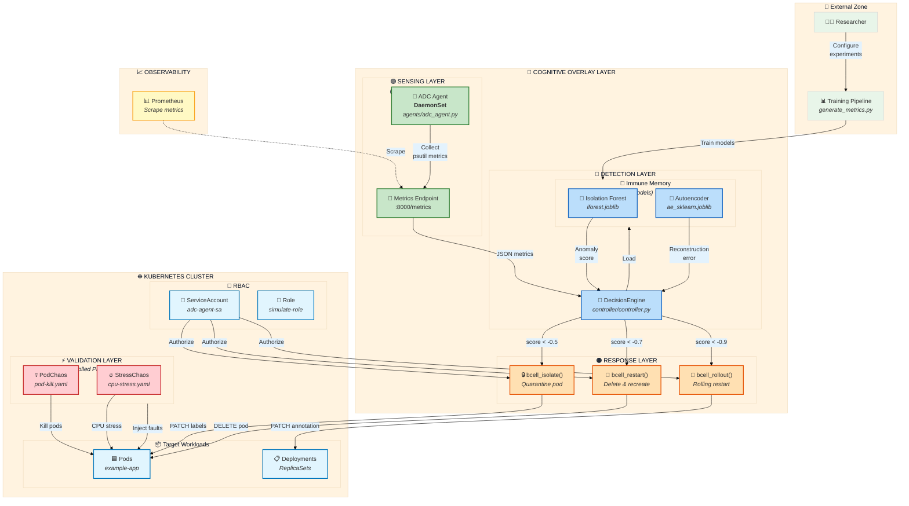

# Cognitive Overlay DIS - System Architecture Diagram



## Layer Descriptions

| Layer | Biological Analog | Component | Function |
|-------|-------------------|-----------|----------|
| **Sensing** | Dendritic Cells | ADC Agent (DaemonSet) | Collects node metrics (CPU, memory, network, disk) as "antigens" |
| **Detection** | T-Helper Cells | DecisionEngine + ML Models | Evaluates antigens using Isolation Forest/Autoencoder to detect anomalies |
| **Response** | B-Cell Effectors | bcell_* functions | Executes adaptive responses via Kubernetes API |
| **Memory** | Immune Memory | Trained ML Models | Retains learned patterns for rapid future detection |
| **Validation** | Controlled Pathogens | Chaos Mesh | Injects faults to validate detection efficacy |

## Data Flow Summary

```
┌─────────────┐    ┌─────────────┐    ┌─────────────┐    ┌─────────────┐
│  ADC Agent  │───▶│  Decision   │───▶│   B-Cell    │───▶│  K8s API    │
│  (Sensing)  │    │  Engine     │    │  Response   │    │  (Action)   │
│             │    │             │    │             │    │             │
│ psutil      │    │ IForest     │    │ isolate()   │    │ PATCH/DELETE│
│ :8000       │    │ Autoencoder │    │ restart()   │    │ pods/deploy │
└─────────────┘    └─────────────┘    └─────────────┘    └─────────────┘
      │                  │                                      │
      │                  │                                      │
      ▼                  ▼                                      ▼
┌─────────────┐    ┌─────────────┐                        ┌─────────────┐
│ Prometheus  │    │ ML Models   │                        │ Target Pods │
│ (Observe)   │    │ (Memory)    │                        │ (Workloads) │
└─────────────┘    └─────────────┘                        └─────────────┘
```
